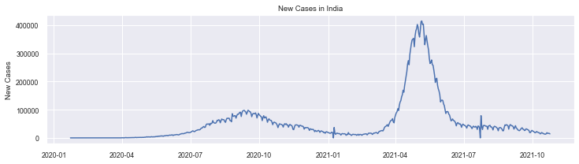
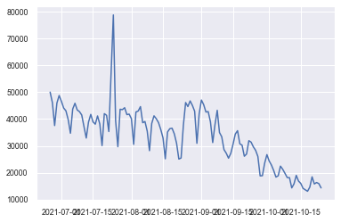
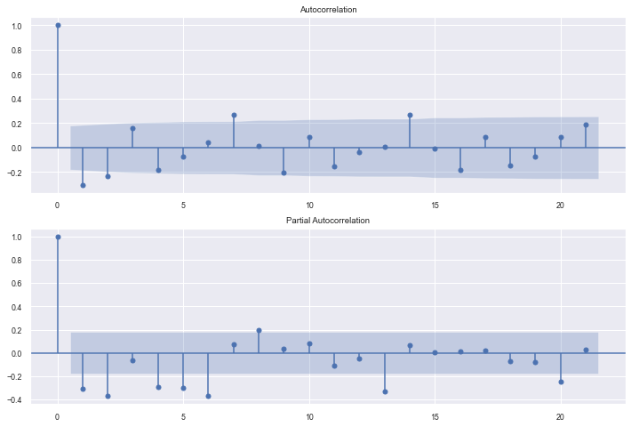
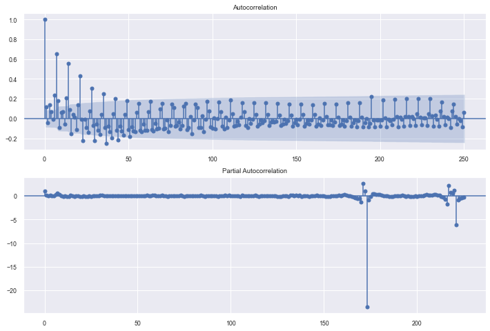
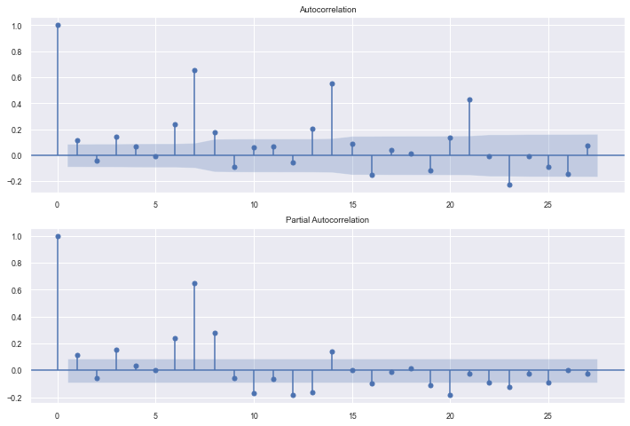
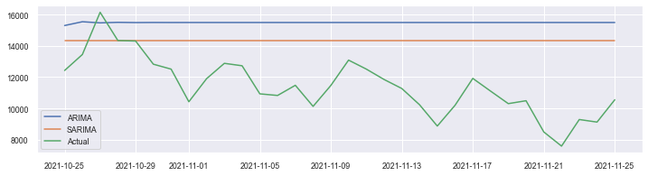
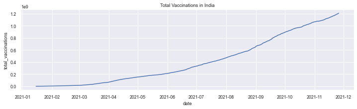
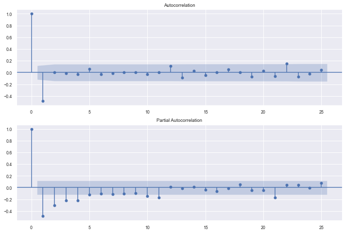
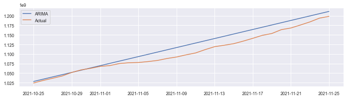

```python
import numpy as np
import pandas as pd
import matplotlib.pyplot as plt
import seaborn as sns

df = pd.read_csv("https://raw.githubusercontent.com/CSSEGISandData/COVID-19/master/csse_covid_19_data/csse_covid_19_time_series/time_series_covid19_confirmed_global.csv", header = None)

india_df = pd.DataFrame(df[df[1] == "India"].transpose().values, df.iloc[0].values)

india_df.columns=['Cases'] 

india_df = india_df.drop(labels=["Province/State", "Country/Region", "Lat", "Long"], axis=0)

india_df.index = pd.to_datetime(india_df.index)
india_df['Cases'] = india_df['Cases'].astype(float)

india_df['New Cases']= india_df['Cases']-india_df['Cases'].shift(1)

test = india_df[-34:-2]

india_df = india_df[:-34]

print(india_df.tail())

print(test)
```

                     Cases  New Cases
    2021-10-20  34127450.0    18454.0
    2021-10-21  34143236.0    15786.0
    2021-10-22  34159562.0    16326.0
    2021-10-23  34175468.0    15906.0
    2021-10-24  34189774.0    14306.0
                     Cases  New Cases
    2021-10-25  34202202.0    12428.0
    2021-10-26  34215653.0    13451.0
    2021-10-27  34231809.0    16156.0
    2021-10-28  34246157.0    14348.0
    2021-10-29  34260470.0    14313.0
    2021-10-30  34273300.0    12830.0
    2021-10-31  34285814.0    12514.0
    2021-11-01  34296237.0    10423.0
    2021-11-02  34308140.0    11903.0
    2021-11-03  34321025.0    12885.0
    2021-11-04  34333754.0    12729.0
    2021-11-05  34344683.0    10929.0
    2021-11-06  34355509.0    10826.0
    2021-11-07  34366987.0    11478.0
    2021-11-08  34377113.0    10126.0
    2021-11-09  34388579.0    11466.0
    2021-11-10  34401670.0    13091.0
    2021-11-11  34414186.0    12516.0
    2021-11-12  34426036.0    11850.0
    2021-11-13  34437307.0    11271.0
    2021-11-14  34447536.0    10229.0
    2021-11-15  34456401.0     8865.0
    2021-11-16  34466598.0    10197.0
    2021-11-17  34478517.0    11919.0
    2021-11-18  34489623.0    11106.0
    2021-11-19  34499925.0    10302.0
    2021-11-20  34510413.0    10488.0
    2021-11-21  34518901.0     8488.0
    2021-11-22  34526480.0     7579.0
    2021-11-23  34535763.0     9283.0
    2021-11-24  34544882.0     9119.0
    2021-11-25  34555431.0    10549.0
    


```python
sns.set(font_scale=0.8)

plt.figure(figsize = (12, 3))

ax = sns.lineplot(x = india_df.index, y  = "New Cases", data = india_df)

plt.title("New Cases in India")
plt.show()
```


    

    


```python
# Dropping New Cases = 0 Values
india_df[india_df["New Cases"] == 0]
india_df.drop(india_df.index[india_df["New Cases"] == 0], axis = 0, inplace = True)
india_df.dropna()
```


<div>
<style scoped>
    .dataframe tbody tr th:only-of-type {
        vertical-align: middle;
    }

    .dataframe tbody tr th {
        vertical-align: top;
    }

    .dataframe thead th {
        text-align: right;
    }
</style>
<table border="1" class="dataframe">
  <thead>
    <tr style="text-align: right;">
      <th></th>
      <th>Cases</th>
      <th>New Cases</th>
    </tr>
  </thead>
  <tbody>
    <tr>
      <th>2020-01-30</th>
      <td>1.0</td>
      <td>1.0</td>
    </tr>
    <tr>
      <th>2020-02-02</th>
      <td>2.0</td>
      <td>1.0</td>
    </tr>
    <tr>
      <th>2020-02-03</th>
      <td>3.0</td>
      <td>1.0</td>
    </tr>
    <tr>
      <th>2020-03-02</th>
      <td>5.0</td>
      <td>2.0</td>
    </tr>
    <tr>
      <th>2020-03-04</th>
      <td>28.0</td>
      <td>23.0</td>
    </tr>
    <tr>
      <th>...</th>
      <td>...</td>
      <td>...</td>
    </tr>
    <tr>
      <th>2021-10-20</th>
      <td>34127450.0</td>
      <td>18454.0</td>
    </tr>
    <tr>
      <th>2021-10-21</th>
      <td>34143236.0</td>
      <td>15786.0</td>
    </tr>
    <tr>
      <th>2021-10-22</th>
      <td>34159562.0</td>
      <td>16326.0</td>
    </tr>
    <tr>
      <th>2021-10-23</th>
      <td>34175468.0</td>
      <td>15906.0</td>
    </tr>
    <tr>
      <th>2021-10-24</th>
      <td>34189774.0</td>
      <td>14306.0</td>
    </tr>
  </tbody>
</table>
<p>602 rows × 2 columns</p>
</div>


```python
current_death_plot = india_df[-120:]
plt.plot(current_death_plot["New Cases"])
```


    [<matplotlib.lines.Line2D at 0x17d639fabb0>]


    

    


```python
### Testing For Stationarity

from statsmodels.tsa.stattools import adfuller
#test_result=adfuller(total_death_plot.iloc[-100:]['new_cases'])


#Ho: It is non stationary
#H1: It is stationary

def adfuller_test(data):
    result=adfuller(data)
    labels = ['ADF Test Statistic','p-value','#Lags Used','Number of Observations Used']
    for value,label in zip(result,labels):
        print(label+' : '+str(value) )
    if result[1] <= 0.05:
        print("strong evidence against the null hypothesis(Ho), reject the null hypothesis. Data has no unit root and is stationary")
    else:
        print("weak evidence against null hypothesis, time series has a unit root, indicating it is non-stationary ")
        
adfuller_test(current_death_plot['New Cases'])
```

    ADF Test Statistic : 0.15667085139650766
    p-value : 0.9697239635404193
    #Lags Used : 13
    Number of Observations Used : 106
    weak evidence against null hypothesis, time series has a unit root, indicating it is non-stationary 
    

# PACF and ACF Plots


```python
from statsmodels.graphics.tsaplots import plot_acf,plot_pacf
import statsmodels.api as sm
fig = plt.figure(figsize=(12,8))
ax1 = fig.add_subplot(211)
fig = sm.graphics.tsa.plot_acf(current_death_plot['New Cases'].diff()[1:], ax=ax1)
ax2 = fig.add_subplot(212)
fig = sm.graphics.tsa.plot_pacf(current_death_plot['New Cases'].diff()[1:], ax=ax2)
```


    

    


## Plots indicate a ARIMA(2, 1, 2) Model


```python
from pmdarima import auto_arima

import warnings

warnings.filterwarnings("ignore")


stepwise_fit = auto_arima(current_death_plot["New Cases"], stepwise=True, trace = True, suppress_warnings = True)

stepwise_fit.summary()
```

    Performing stepwise search to minimize aic
     ARIMA(2,1,2)(0,0,0)[0] intercept   : AIC=2433.073, Time=0.20 sec
     ARIMA(0,1,0)(0,0,0)[0] intercept   : AIC=2455.497, Time=0.02 sec
     ARIMA(1,1,0)(0,0,0)[0] intercept   : AIC=2447.467, Time=0.04 sec
     ARIMA(0,1,1)(0,0,0)[0] intercept   : AIC=2435.070, Time=0.04 sec
     ARIMA(0,1,0)(0,0,0)[0]             : AIC=2453.708, Time=0.01 sec
     ARIMA(1,1,2)(0,0,0)[0] intercept   : AIC=2430.111, Time=0.09 sec
     ARIMA(0,1,2)(0,0,0)[0] intercept   : AIC=2425.164, Time=0.19 sec
     ARIMA(0,1,3)(0,0,0)[0] intercept   : AIC=2434.327, Time=0.07 sec
     ARIMA(1,1,1)(0,0,0)[0] intercept   : AIC=2428.392, Time=0.19 sec
     ARIMA(1,1,3)(0,0,0)[0] intercept   : AIC=2430.502, Time=0.14 sec
     ARIMA(0,1,2)(0,0,0)[0]             : AIC=2424.723, Time=0.06 sec
     ARIMA(0,1,1)(0,0,0)[0]             : AIC=2432.032, Time=0.03 sec
     ARIMA(1,1,2)(0,0,0)[0]             : AIC=2424.132, Time=0.07 sec
     ARIMA(1,1,1)(0,0,0)[0]             : AIC=2427.938, Time=0.05 sec
     ARIMA(2,1,2)(0,0,0)[0]             : AIC=2426.210, Time=0.10 sec
     ARIMA(1,1,3)(0,0,0)[0]             : AIC=2426.096, Time=0.15 sec
     ARIMA(0,1,3)(0,0,0)[0]             : AIC=2425.048, Time=0.06 sec
     ARIMA(2,1,1)(0,0,0)[0]             : AIC=2427.813, Time=0.10 sec
     ARIMA(2,1,3)(0,0,0)[0]             : AIC=2428.014, Time=0.19 sec
    
    Best model:  ARIMA(1,1,2)(0,0,0)[0]          
    Total fit time: 1.817 seconds
    


<table class="simpletable">
<caption>SARIMAX Results</caption>
<tr>
  <th>Dep. Variable:</th>           <td>y</td>        <th>  No. Observations:  </th>    <td>120</td>   
</tr>
<tr>
  <th>Model:</th>           <td>SARIMAX(1, 1, 2)</td> <th>  Log Likelihood     </th> <td>-1208.066</td>
</tr>
<tr>
  <th>Date:</th>            <td>Sun, 28 Nov 2021</td> <th>  AIC                </th> <td>2424.132</td> 
</tr>
<tr>
  <th>Time:</th>                <td>10:56:07</td>     <th>  BIC                </th> <td>2435.248</td> 
</tr>
<tr>
  <th>Sample:</th>                  <td>0</td>        <th>  HQIC               </th> <td>2428.646</td> 
</tr>
<tr>
  <th></th>                      <td> - 120</td>      <th>                     </th>     <td> </td>    
</tr>
<tr>
  <th>Covariance Type:</th>        <td>opg</td>       <th>                     </th>     <td> </td>    
</tr>
</table>
<table class="simpletable">
<tr>
     <td></td>       <th>coef</th>     <th>std err</th>      <th>z</th>      <th>P>|z|</th>  <th>[0.025</th>    <th>0.975]</th>  
</tr>
<tr>
  <th>ar.L1</th>  <td>   -0.3920</td> <td>    0.201</td> <td>   -1.948</td> <td> 0.051</td> <td>   -0.786</td> <td>    0.002</td>
</tr>
<tr>
  <th>ma.L1</th>  <td>   -0.0731</td> <td>    0.210</td> <td>   -0.348</td> <td> 0.728</td> <td>   -0.485</td> <td>    0.339</td>
</tr>
<tr>
  <th>ma.L2</th>  <td>   -0.5030</td> <td>    0.110</td> <td>   -4.571</td> <td> 0.000</td> <td>   -0.719</td> <td>   -0.287</td>
</tr>
<tr>
  <th>sigma2</th> <td> 3.631e+07</td> <td> 2.69e-08</td> <td> 1.35e+15</td> <td> 0.000</td> <td> 3.63e+07</td> <td> 3.63e+07</td>
</tr>
</table>
<table class="simpletable">
<tr>
  <th>Ljung-Box (L1) (Q):</th>     <td>0.02</td> <th>  Jarque-Bera (JB):  </th> <td>1379.84</td>
</tr>
<tr>
  <th>Prob(Q):</th>                <td>0.88</td> <th>  Prob(JB):          </th>  <td>0.00</td>  
</tr>
<tr>
  <th>Heteroskedasticity (H):</th> <td>0.11</td> <th>  Skew:              </th>  <td>2.24</td>  
</tr>
<tr>
  <th>Prob(H) (two-sided):</th>    <td>0.00</td> <th>  Kurtosis:          </th>  <td>19.07</td> 
</tr>
</table><br/><br/>Warnings:<br/>[1] Covariance matrix calculated using the outer product of gradients (complex-step).<br/>[2] Covariance matrix is singular or near-singular, with condition number 2.46e+31. Standard errors may be unstable.


```python
from statsmodels.tsa.arima.model import ARIMA

testing_data = test

model=ARIMA(current_death_plot['New Cases'],order=(2, 1, 2))
model_fit=model.fit()

model_fit.summary()
```


<table class="simpletable">
<caption>SARIMAX Results</caption>
<tr>
  <th>Dep. Variable:</th>       <td>New Cases</td>    <th>  No. Observations:  </th>    <td>120</td>   
</tr>
<tr>
  <th>Model:</th>            <td>ARIMA(2, 1, 2)</td>  <th>  Log Likelihood     </th> <td>-1208.105</td>
</tr>
<tr>
  <th>Date:</th>            <td>Sun, 28 Nov 2021</td> <th>  AIC                </th> <td>2426.210</td> 
</tr>
<tr>
  <th>Time:</th>                <td>11:08:24</td>     <th>  BIC                </th> <td>2440.106</td> 
</tr>
<tr>
  <th>Sample:</th>                  <td>0</td>        <th>  HQIC               </th> <td>2431.853</td> 
</tr>
<tr>
  <th></th>                      <td> - 120</td>      <th>                     </th>     <td> </td>    
</tr>
<tr>
  <th>Covariance Type:</th>        <td>opg</td>       <th>                     </th>     <td> </td>    
</tr>
</table>
<table class="simpletable">
<tr>
     <td></td>       <th>coef</th>     <th>std err</th>      <th>z</th>      <th>P>|z|</th>  <th>[0.025</th>    <th>0.975]</th>  
</tr>
<tr>
  <th>ar.L1</th>  <td>   -0.3921</td> <td>    0.229</td> <td>   -1.716</td> <td> 0.086</td> <td>   -0.840</td> <td>    0.056</td>
</tr>
<tr>
  <th>ar.L2</th>  <td>    0.0225</td> <td>    0.192</td> <td>    0.117</td> <td> 0.907</td> <td>   -0.353</td> <td>    0.398</td>
</tr>
<tr>
  <th>ma.L1</th>  <td>   -0.0690</td> <td>    0.242</td> <td>   -0.285</td> <td> 0.776</td> <td>   -0.543</td> <td>    0.405</td>
</tr>
<tr>
  <th>ma.L2</th>  <td>   -0.5208</td> <td>    0.237</td> <td>   -2.194</td> <td> 0.028</td> <td>   -0.986</td> <td>   -0.056</td>
</tr>
<tr>
  <th>sigma2</th> <td> 3.575e+07</td> <td>  4.2e-08</td> <td>  8.5e+14</td> <td> 0.000</td> <td> 3.58e+07</td> <td> 3.58e+07</td>
</tr>
</table>
<table class="simpletable">
<tr>
  <th>Ljung-Box (L1) (Q):</th>     <td>0.05</td> <th>  Jarque-Bera (JB):  </th> <td>1393.70</td>
</tr>
<tr>
  <th>Prob(Q):</th>                <td>0.83</td> <th>  Prob(JB):          </th>  <td>0.00</td>  
</tr>
<tr>
  <th>Heteroskedasticity (H):</th> <td>0.11</td> <th>  Skew:              </th>  <td>2.24</td>  
</tr>
<tr>
  <th>Prob(H) (two-sided):</th>    <td>0.00</td> <th>  Kurtosis:          </th>  <td>19.15</td> 
</tr>
</table><br/><br/>Warnings:<br/>[1] Covariance matrix calculated using the outer product of gradients (complex-step).<br/>[2] Covariance matrix is singular or near-singular, with condition number 5.96e+29. Standard errors may be unstable.


```python
start = len(current_death_plot)
end = len(current_death_plot) + len(testing_data) -1
pred = model_fit.predict(start = start, end = end, typ = 'levels')

index_future_dates = pd.date_range(start = '2021-10-25', end = '2021-11-25')

pred.index = index_future_dates
#print(current_death_plot.index[start: end + 1])
print(pred)
```

    2021-10-25    15309.463474
    2021-10-26    15551.386540
    2021-10-27    15479.066061
    2021-10-28    15512.858844
    2021-10-29    15497.983456
    2021-10-30    15504.575495
    2021-10-31    15501.656473
    2021-11-01    15502.949159
    2021-11-02    15502.376700
    2021-11-03    15502.630211
    2021-11-04    15502.517945
    2021-11-05    15502.567661
    2021-11-06    15502.545644
    2021-11-07    15502.555394
    2021-11-08    15502.551077
    2021-11-09    15502.552989
    2021-11-10    15502.552142
    2021-11-11    15502.552517
    2021-11-12    15502.552351
    2021-11-13    15502.552425
    2021-11-14    15502.552392
    2021-11-15    15502.552406
    2021-11-16    15502.552400
    2021-11-17    15502.552403
    2021-11-18    15502.552402
    2021-11-19    15502.552402
    2021-11-20    15502.552402
    2021-11-21    15502.552402
    2021-11-22    15502.552402
    2021-11-23    15502.552402
    2021-11-24    15502.552402
    2021-11-25    15502.552402
    Freq: D, Name: predicted_mean, dtype: float64
    

## SARIMA


```python
training_data1 = india_df['New Cases'][-500:]
```


```python
from statsmodels.graphics.tsaplots import plot_acf,plot_pacf
import statsmodels.api as sm
fig = plt.figure(figsize=(12,8))
ax1 = fig.add_subplot(211)
fig = sm.graphics.tsa.plot_acf(training_data1.diff()[1:], ax=ax1, lags = 250)
ax2 = fig.add_subplot(212)
fig = sm.graphics.tsa.plot_pacf(training_data1.diff()[1:], ax=ax2, lags = 225)
```


    

    


```python
from statsmodels.graphics.tsaplots import plot_acf,plot_pacf
import statsmodels.api as sm
fig = plt.figure(figsize=(12,8))
ax1 = fig.add_subplot(211)
fig = sm.graphics.tsa.plot_acf(training_data1.diff()[1:], ax=ax1)
ax2 = fig.add_subplot(212)
fig = sm.graphics.tsa.plot_pacf(training_data1.diff()[1:], ax=ax2)
```


    

    


## Plots indicate SARIMA(1, 1, 1)(0, 0, 2, 3)


```python
from pmdarima import auto_arima

import warnings

warnings.filterwarnings("ignore")


stepwise_fit = auto_arima(current_death_plot["New Cases"], seasona=True, m = 3, stepwise=True, trace = True, suppress_warnings = True)

stepwise_fit.summary()
```

    Performing stepwise search to minimize aic
     ARIMA(2,1,2)(1,0,1)[3] intercept   : AIC=2430.965, Time=0.45 sec
     ARIMA(0,1,0)(0,0,0)[3] intercept   : AIC=2455.497, Time=0.01 sec
     ARIMA(1,1,0)(1,0,0)[3] intercept   : AIC=2447.057, Time=0.06 sec
     ARIMA(0,1,1)(0,0,1)[3] intercept   : AIC=2436.914, Time=0.06 sec
     ARIMA(0,1,0)(0,0,0)[3]             : AIC=2453.708, Time=0.01 sec
     ARIMA(2,1,2)(0,0,1)[3] intercept   : AIC=2431.510, Time=0.28 sec
     ARIMA(2,1,2)(1,0,0)[3] intercept   : AIC=2430.257, Time=0.27 sec
     ARIMA(2,1,2)(0,0,0)[3] intercept   : AIC=2433.073, Time=0.19 sec
     ARIMA(2,1,2)(2,0,0)[3] intercept   : AIC=2432.075, Time=0.27 sec
     ARIMA(2,1,2)(2,0,1)[3] intercept   : AIC=2432.960, Time=0.64 sec
     ARIMA(1,1,2)(1,0,0)[3] intercept   : AIC=2431.851, Time=0.11 sec
     ARIMA(2,1,1)(1,0,0)[3] intercept   : AIC=2430.240, Time=0.18 sec
     ARIMA(2,1,1)(0,0,0)[3] intercept   : AIC=2431.603, Time=0.12 sec
     ARIMA(2,1,1)(2,0,0)[3] intercept   : AIC=2432.183, Time=0.22 sec
     ARIMA(2,1,1)(1,0,1)[3] intercept   : AIC=2428.829, Time=0.35 sec
     ARIMA(2,1,1)(0,0,1)[3] intercept   : AIC=2428.353, Time=0.17 sec
     ARIMA(2,1,1)(0,0,2)[3] intercept   : AIC=2429.224, Time=0.27 sec
     ARIMA(2,1,1)(1,0,2)[3] intercept   : AIC=inf, Time=0.52 sec
     ARIMA(1,1,1)(0,0,1)[3] intercept   : AIC=2434.655, Time=0.07 sec
     ARIMA(2,1,0)(0,0,1)[3] intercept   : AIC=2430.183, Time=0.09 sec
     ARIMA(1,1,0)(0,0,1)[3] intercept   : AIC=2447.347, Time=0.04 sec
     ARIMA(1,1,2)(0,0,1)[3] intercept   : AIC=2432.106, Time=0.15 sec
     ARIMA(2,1,1)(0,0,1)[3]             : AIC=2427.325, Time=0.14 sec
     ARIMA(2,1,1)(0,0,0)[3]             : AIC=2427.813, Time=0.12 sec
     ARIMA(2,1,1)(1,0,1)[3]             : AIC=2428.208, Time=0.31 sec
     ARIMA(2,1,1)(0,0,2)[3]             : AIC=2428.659, Time=0.26 sec
     ARIMA(2,1,1)(1,0,0)[3]             : AIC=2428.636, Time=0.14 sec
     ARIMA(2,1,1)(1,0,2)[3]             : AIC=inf, Time=0.53 sec
     ARIMA(1,1,1)(0,0,1)[3]             : AIC=2427.060, Time=0.19 sec
     ARIMA(1,1,1)(0,0,0)[3]             : AIC=2427.938, Time=0.04 sec
     ARIMA(1,1,1)(1,0,1)[3]             : AIC=2428.423, Time=0.14 sec
     ARIMA(1,1,1)(0,0,2)[3]             : AIC=2427.002, Time=0.11 sec
     ARIMA(1,1,1)(1,0,2)[3]             : AIC=2427.650, Time=0.18 sec
     ARIMA(0,1,1)(0,0,2)[3]             : AIC=2433.987, Time=0.07 sec
     ARIMA(1,1,0)(0,0,2)[3]             : AIC=2445.672, Time=0.06 sec
     ARIMA(1,1,2)(0,0,2)[3]             : AIC=2427.040, Time=0.20 sec
     ARIMA(0,1,0)(0,0,2)[3]             : AIC=2452.929, Time=0.04 sec
     ARIMA(0,1,2)(0,0,2)[3]             : AIC=2425.142, Time=0.12 sec
     ARIMA(0,1,2)(0,0,1)[3]             : AIC=2424.426, Time=0.07 sec
     ARIMA(0,1,2)(0,0,0)[3]             : AIC=2424.723, Time=0.05 sec
     ARIMA(0,1,2)(1,0,1)[3]             : AIC=2426.101, Time=0.13 sec
     ARIMA(0,1,2)(1,0,0)[3]             : AIC=2424.155, Time=0.09 sec
     ARIMA(0,1,2)(2,0,0)[3]             : AIC=2425.969, Time=0.11 sec
     ARIMA(0,1,2)(2,0,1)[3]             : AIC=2427.132, Time=0.23 sec
     ARIMA(0,1,1)(1,0,0)[3]             : AIC=2433.895, Time=0.05 sec
     ARIMA(1,1,2)(1,0,0)[3]             : AIC=2426.091, Time=0.10 sec
     ARIMA(1,1,1)(1,0,0)[3]             : AIC=2426.523, Time=0.10 sec
     ARIMA(0,1,2)(1,0,0)[3] intercept   : AIC=2424.724, Time=0.26 sec
    
    Best model:  ARIMA(0,1,2)(1,0,0)[3]          
    Total fit time: 8.443 seconds
    


<table class="simpletable">
<caption>SARIMAX Results</caption>
<tr>
  <th>Dep. Variable:</th>                  <td>y</td>               <th>  No. Observations:  </th>    <td>120</td>   
</tr>
<tr>
  <th>Model:</th>           <td>SARIMAX(0, 1, 2)x(1, 0, [], 3)</td> <th>  Log Likelihood     </th> <td>-1208.077</td>
</tr>
<tr>
  <th>Date:</th>                   <td>Sun, 28 Nov 2021</td>        <th>  AIC                </th> <td>2424.155</td> 
</tr>
<tr>
  <th>Time:</th>                       <td>11:03:56</td>            <th>  BIC                </th> <td>2435.271</td> 
</tr>
<tr>
  <th>Sample:</th>                         <td>0</td>               <th>  HQIC               </th> <td>2428.669</td> 
</tr>
<tr>
  <th></th>                             <td> - 120</td>             <th>                     </th>     <td> </td>    
</tr>
<tr>
  <th>Covariance Type:</th>               <td>opg</td>              <th>                     </th>     <td> </td>    
</tr>
</table>
<table class="simpletable">
<tr>
     <td></td>        <th>coef</th>     <th>std err</th>      <th>z</th>      <th>P>|z|</th>  <th>[0.025</th>    <th>0.975]</th>  
</tr>
<tr>
  <th>ma.L1</th>   <td>   -0.4526</td> <td>    0.040</td> <td>  -11.319</td> <td> 0.000</td> <td>   -0.531</td> <td>   -0.374</td>
</tr>
<tr>
  <th>ma.L2</th>   <td>   -0.3024</td> <td>    0.079</td> <td>   -3.841</td> <td> 0.000</td> <td>   -0.457</td> <td>   -0.148</td>
</tr>
<tr>
  <th>ar.S.L3</th> <td>    0.1276</td> <td>    0.077</td> <td>    1.665</td> <td> 0.096</td> <td>   -0.023</td> <td>    0.278</td>
</tr>
<tr>
  <th>sigma2</th>  <td> 3.745e+07</td> <td> 2.28e-09</td> <td> 1.65e+16</td> <td> 0.000</td> <td> 3.74e+07</td> <td> 3.74e+07</td>
</tr>
</table>
<table class="simpletable">
<tr>
  <th>Ljung-Box (L1) (Q):</th>     <td>0.08</td> <th>  Jarque-Bera (JB):  </th> <td>1338.77</td>
</tr>
<tr>
  <th>Prob(Q):</th>                <td>0.78</td> <th>  Prob(JB):          </th>  <td>0.00</td>  
</tr>
<tr>
  <th>Heteroskedasticity (H):</th> <td>0.11</td> <th>  Skew:              </th>  <td>2.16</td>  
</tr>
<tr>
  <th>Prob(H) (two-sided):</th>    <td>0.00</td> <th>  Kurtosis:          </th>  <td>18.85</td> 
</tr>
</table><br/><br/>Warnings:<br/>[1] Covariance matrix calculated using the outer product of gradients (complex-step).<br/>[2] Covariance matrix is singular or near-singular, with condition number 4.33e+30. Standard errors may be unstable.


```python
from statsmodels.tsa.statespace.sarimax import SARIMAX


model=SARIMAX(training_data,order=(1,1,1), seasonal_order = (0, 0, 1, 3))
model_fit1=model.fit(disp=0)
model_fit1.summary()
```


<table class="simpletable">
<caption>SARIMAX Results</caption>
<tr>
  <th>Dep. Variable:</th>             <td>New Cases</td>           <th>  No. Observations:  </th>    <td>450</td>   
</tr>
<tr>
  <th>Model:</th>           <td>SARIMAX(1, 1, 1)x(0, 0, 1, 3)</td> <th>  Log Likelihood     </th> <td>-4705.381</td>
</tr>
<tr>
  <th>Date:</th>                  <td>Sun, 28 Nov 2021</td>        <th>  AIC                </th> <td>9418.762</td> 
</tr>
<tr>
  <th>Time:</th>                      <td>11:13:17</td>            <th>  BIC                </th> <td>9435.190</td> 
</tr>
<tr>
  <th>Sample:</th>                        <td>0</td>               <th>  HQIC               </th> <td>9425.237</td> 
</tr>
<tr>
  <th></th>                            <td> - 450</td>             <th>                     </th>     <td> </td>    
</tr>
<tr>
  <th>Covariance Type:</th>              <td>opg</td>              <th>                     </th>     <td> </td>    
</tr>
</table>
<table class="simpletable">
<tr>
     <td></td>        <th>coef</th>     <th>std err</th>      <th>z</th>      <th>P>|z|</th>  <th>[0.025</th>    <th>0.975]</th>  
</tr>
<tr>
  <th>ar.L1</th>   <td>   -0.6880</td> <td>    0.083</td> <td>   -8.324</td> <td> 0.000</td> <td>   -0.850</td> <td>   -0.526</td>
</tr>
<tr>
  <th>ma.L1</th>   <td>    0.8136</td> <td>    0.081</td> <td>   10.056</td> <td> 0.000</td> <td>    0.655</td> <td>    0.972</td>
</tr>
<tr>
  <th>ma.S.L3</th> <td>    0.0517</td> <td>    0.037</td> <td>    1.406</td> <td> 0.160</td> <td>   -0.020</td> <td>    0.124</td>
</tr>
<tr>
  <th>sigma2</th>  <td> 7.545e+07</td> <td> 1.03e-09</td> <td> 7.31e+16</td> <td> 0.000</td> <td> 7.55e+07</td> <td> 7.55e+07</td>
</tr>
</table>
<table class="simpletable">
<tr>
  <th>Ljung-Box (L1) (Q):</th>     <td>0.09</td> <th>  Jarque-Bera (JB):  </th> <td>712.72</td>
</tr>
<tr>
  <th>Prob(Q):</th>                <td>0.76</td> <th>  Prob(JB):          </th>  <td>0.00</td> 
</tr>
<tr>
  <th>Heteroskedasticity (H):</th> <td>1.75</td> <th>  Skew:              </th>  <td>0.12</td> 
</tr>
<tr>
  <th>Prob(H) (two-sided):</th>    <td>0.00</td> <th>  Kurtosis:          </th>  <td>9.17</td> 
</tr>
</table><br/><br/>Warnings:<br/>[1] Covariance matrix calculated using the outer product of gradients (complex-step).<br/>[2] Covariance matrix is singular or near-singular, with condition number 3.69e+32. Standard errors may be unstable.


```python
start = len(training_data1)
end = len(training_data1) + len(testing_data) -1
pred1 = model_fit1.predict(start = start, end = end, typ = 'levels')

index_future_dates = pd.date_range(start = '2021-10-25', end = '2021-11-25')

pred1.index = index_future_dates
#print(current_death_plot.index[start: end + 1])
print(pred1)
```

    2021-10-25    14343.648854
    2021-10-26    14343.648853
    2021-10-27    14343.648854
    2021-10-28    14343.648853
    2021-10-29    14343.648854
    2021-10-30    14343.648854
    2021-10-31    14343.648854
    2021-11-01    14343.648854
    2021-11-02    14343.648854
    2021-11-03    14343.648854
    2021-11-04    14343.648854
    2021-11-05    14343.648854
    2021-11-06    14343.648854
    2021-11-07    14343.648854
    2021-11-08    14343.648854
    2021-11-09    14343.648854
    2021-11-10    14343.648854
    2021-11-11    14343.648854
    2021-11-12    14343.648854
    2021-11-13    14343.648854
    2021-11-14    14343.648854
    2021-11-15    14343.648854
    2021-11-16    14343.648854
    2021-11-17    14343.648854
    2021-11-18    14343.648854
    2021-11-19    14343.648854
    2021-11-20    14343.648854
    2021-11-21    14343.648854
    2021-11-22    14343.648854
    2021-11-23    14343.648854
    2021-11-24    14343.648854
    2021-11-25    14343.648854
    Freq: D, Name: predicted_mean, dtype: float64
    


```python
sns.set(font_scale=0.8)

plt.figure(figsize = (12, 3))

plt.plot(pred, label ='ARIMA')
plt.plot(pred1, label ='SARIMA')
plt.plot(test["New Cases"], label ='Actual')

plt.legend(loc ="best")
```


    <matplotlib.legend.Legend at 0x17d668c27f0>


    

    


```python
# For 1 Day Ahead Forecast
from math import sqrt

print("1 Day Ahead Forecast")
print("ARIMA -", sqrt((pred[0] - test.iloc[0]["New Cases"])**2))
print("SARIMA -", sqrt((pred1[0] - test.iloc[0]["New Cases"])**2))
```

    1 Day Ahead Forecast
    ARIMA - 2881.4634744228933
    SARIMA - 1915.6488541686758
    


```python
# For 7 Day Ahead Forecast
from statsmodels.tools.eval_measures import rmse

print("7 Day Ahead Forecast")
print("ARIMA - ", rmse(pred[:8], test.iloc[:8]["New Cases"]))
print("SARIMA - ", rmse(pred1[:8], test.iloc[:8]["New Cases"]))
```

    7 Day Ahead Forecast
    ARIMA -  2688.380218270449
    SARIMA -  1896.1257435415707
    


```python
# For 1 Month Ahead Forecast
from statsmodels.tools.eval_measures import rmse

print("1 Month Ahead Forecast")
print("ARIMA - ", rmse(pred, test["New Cases"]))
print("SARIMA - ", rmse(pred1, test["New Cases"]))
```

    1 Month Ahead Forecast
    ARIMA -  4457.518921452215
    SARIMA -  3434.1858625005348
    

## Predicting Vaccination Rate


```python
vac_url = "https://raw.githubusercontent.com/owid/covid-19-data/master/public/data/vaccinations/country_data/India.csv"

vac_df = pd.read_csv(vac_url)

vac_df.index = pd.to_datetime(vac_df.date)
vac_df = vac_df.drop(labels=["date","vaccine", "location", "people_vaccinated", "people_fully_vaccinated", "source_url","total_boosters"], axis=1)


vac_df.tail()

train_vac = vac_df.iloc[:-33]
test_vac = vac_df.iloc[-33:-1]

#print(train_vac.tail())
test_vac.tail()
```


<div>
<style scoped>
    .dataframe tbody tr th:only-of-type {
        vertical-align: middle;
    }

    .dataframe tbody tr th {
        vertical-align: top;
    }

    .dataframe thead th {
        text-align: right;
    }
</style>
<table border="1" class="dataframe">
  <thead>
    <tr style="text-align: right;">
      <th></th>
      <th>total_vaccinations</th>
    </tr>
    <tr>
      <th>date</th>
      <th></th>
    </tr>
  </thead>
  <tbody>
    <tr>
      <th>2021-11-21</th>
      <td>1168057227</td>
    </tr>
    <tr>
      <th>2021-11-22</th>
      <td>1175843376</td>
    </tr>
    <tr>
      <th>2021-11-23</th>
      <td>1183947210</td>
    </tr>
    <tr>
      <th>2021-11-24</th>
      <td>1193769229</td>
    </tr>
    <tr>
      <th>2021-11-25</th>
      <td>1198528642</td>
    </tr>
  </tbody>
</table>
</div>


```python
sns.set(font_scale=0.8)

plt.figure(figsize = (12, 3))

ax = sns.lineplot(x = vac_df.index, y  = "total_vaccinations", data = vac_df)

plt.title("Total Vaccinations in India")
plt.show()
```


    

    


```python
### Testing For Stationarity

from statsmodels.tsa.stattools import adfuller
#test_result=adfuller(total_death_plot.iloc[-100:]['new_cases'])


#Ho: It is non stationary
#H1: It is stationary

def adfuller_test(data):
    result=adfuller(data)
    labels = ['ADF Test Statistic','p-value','#Lags Used','Number of Observations Used']
    for value,label in zip(result,labels):
        print(label+' : '+str(value) )
    if result[1] <= 0.05:
        print("strong evidence against the null hypothesis(Ho), reject the null hypothesis. Data has no unit root and is stationary")
    else:
        print("weak evidence against null hypothesis, time series has a unit root, indicating it is non-stationary ")
        
adfuller_test(vac_df["total_vaccinations"])
```

    ADF Test Statistic : 1.3631259456359566
    p-value : 0.9969400182483313
    #Lags Used : 12
    Number of Observations Used : 292
    weak evidence against null hypothesis, time series has a unit root, indicating it is non-stationary 
    

# PACF And ACF Plots


```python
from statsmodels.graphics.tsaplots import plot_acf,plot_pacf
import statsmodels.api as sm
fig = plt.figure(figsize=(12,8))
ax1 = fig.add_subplot(211)
fig = sm.graphics.tsa.plot_acf(train_vac["total_vaccinations"].diff().diff()[2:], ax=ax1)
ax2 = fig.add_subplot(212)
fig = sm.graphics.tsa.plot_pacf(train_vac["total_vaccinations"].diff().diff()[2:], ax=ax2)
```


    

    


# ARIMA(4, 2, 1)


```python
from pmdarima import auto_arima

import warnings

warnings.filterwarnings("ignore")


stepwise_fit = auto_arima(train_vac["total_vaccinations"], d = 2, stepwise=True, trace = True, suppress_warnings = True)

stepwise_fit.summary()
```

    Performing stepwise search to minimize aic
     ARIMA(2,2,2)(0,0,0)[0]             : AIC=8647.305, Time=0.14 sec
     ARIMA(0,2,0)(0,0,0)[0]             : AIC=8783.396, Time=0.01 sec
     ARIMA(1,2,0)(0,0,0)[0]             : AIC=8712.014, Time=0.02 sec
     ARIMA(0,2,1)(0,0,0)[0]             : AIC=8642.913, Time=0.05 sec
     ARIMA(1,2,1)(0,0,0)[0]             : AIC=8644.747, Time=0.08 sec
     ARIMA(0,2,2)(0,0,0)[0]             : AIC=8643.625, Time=0.06 sec
     ARIMA(1,2,2)(0,0,0)[0]             : AIC=8645.432, Time=0.08 sec
     ARIMA(0,2,1)(0,0,0)[0] intercept   : AIC=8646.709, Time=0.07 sec
    
    Best model:  ARIMA(0,2,1)(0,0,0)[0]          
    Total fit time: 0.511 seconds
    


<table class="simpletable">
<caption>SARIMAX Results</caption>
<tr>
  <th>Dep. Variable:</th>           <td>y</td>        <th>  No. Observations:  </th>    <td>272</td>   
</tr>
<tr>
  <th>Model:</th>           <td>SARIMAX(0, 2, 1)</td> <th>  Log Likelihood     </th> <td>-4319.457</td>
</tr>
<tr>
  <th>Date:</th>            <td>Sun, 28 Nov 2021</td> <th>  AIC                </th> <td>8642.913</td> 
</tr>
<tr>
  <th>Time:</th>                <td>11:36:44</td>     <th>  BIC                </th> <td>8650.110</td> 
</tr>
<tr>
  <th>Sample:</th>                  <td>0</td>        <th>  HQIC               </th> <td>8645.803</td> 
</tr>
<tr>
  <th></th>                      <td> - 272</td>      <th>                     </th>     <td> </td>    
</tr>
<tr>
  <th>Covariance Type:</th>        <td>opg</td>       <th>                     </th>     <td> </td>    
</tr>
</table>
<table class="simpletable">
<tr>
     <td></td>       <th>coef</th>     <th>std err</th>      <th>z</th>      <th>P>|z|</th>  <th>[0.025</th>    <th>0.975]</th>  
</tr>
<tr>
  <th>ma.L1</th>  <td>   -0.8717</td> <td>    0.030</td> <td>  -29.120</td> <td> 0.000</td> <td>   -0.930</td> <td>   -0.813</td>
</tr>
<tr>
  <th>sigma2</th> <td> 5.234e+12</td> <td> 2.71e-16</td> <td> 1.93e+28</td> <td> 0.000</td> <td> 5.23e+12</td> <td> 5.23e+12</td>
</tr>
</table>
<table class="simpletable">
<tr>
  <th>Ljung-Box (L1) (Q):</th>     <td>0.08</td>  <th>  Jarque-Bera (JB):  </th> <td>347.56</td>
</tr>
<tr>
  <th>Prob(Q):</th>                <td>0.78</td>  <th>  Prob(JB):          </th>  <td>0.00</td> 
</tr>
<tr>
  <th>Heteroskedasticity (H):</th> <td>20.27</td> <th>  Skew:              </th>  <td>1.16</td> 
</tr>
<tr>
  <th>Prob(H) (two-sided):</th>    <td>0.00</td>  <th>  Kurtosis:          </th>  <td>8.05</td> 
</tr>
</table><br/><br/>Warnings:<br/>[1] Covariance matrix calculated using the outer product of gradients (complex-step).<br/>[2] Covariance matrix is singular or near-singular, with condition number    inf. Standard errors may be unstable.


```python
from statsmodels.tsa.arima.model import ARIMA

testing_data = test

vac_model=ARIMA(train_vac["total_vaccinations"],order=(4, 2, 1))
vac_model_fit=vac_model.fit()

vac_model_fit.summary()

start = len(train_vac)
end = len(train_vac) + len(test_vac) -1
vac_pred = vac_model_fit.predict(start = start, end = end, typ = 'levels')

index_future_dates = pd.date_range(start = '2021-10-25', end = '2021-11-25')

vac_pred.index = index_future_dates
#print(current_death_plot.index[start: end + 1])
print(vac_pred)
```

    2021-10-25    1.028198e+09
    2021-10-26    1.034166e+09
    2021-10-27    1.040090e+09
    2021-10-28    1.045928e+09
    2021-10-29    1.051835e+09
    2021-10-30    1.057742e+09
    2021-10-31    1.063653e+09
    2021-11-01    1.069565e+09
    2021-11-02    1.075475e+09
    2021-11-03    1.081385e+09
    2021-11-04    1.087295e+09
    2021-11-05    1.093206e+09
    2021-11-06    1.099116e+09
    2021-11-07    1.105026e+09
    2021-11-08    1.110936e+09
    2021-11-09    1.116846e+09
    2021-11-10    1.122756e+09
    2021-11-11    1.128666e+09
    2021-11-12    1.134576e+09
    2021-11-13    1.140486e+09
    2021-11-14    1.146396e+09
    2021-11-15    1.152306e+09
    2021-11-16    1.158216e+09
    2021-11-17    1.164126e+09
    2021-11-18    1.170036e+09
    2021-11-19    1.175947e+09
    2021-11-20    1.181857e+09
    2021-11-21    1.187767e+09
    2021-11-22    1.193677e+09
    2021-11-23    1.199587e+09
    2021-11-24    1.205497e+09
    2021-11-25    1.211407e+09
    Freq: D, Name: predicted_mean, dtype: float64
    


```python
sns.set(font_scale=0.8)

plt.figure(figsize = (12, 3))

plt.plot(vac_pred, label ='ARIMA')
plt.plot(test_vac["total_vaccinations"], label ='Actual')

plt.legend(loc ="best")
```


    <matplotlib.legend.Legend at 0x17d615b40d0>


    

    


```python
# For 1 Month Ahead Forecast
from statsmodels.tools.eval_measures import rmse

print("1 Month Ahead Forecast")
print("ARIMA - ", rmse(vac_pred, test_vac["total_vaccinations"]))
```

    1 Month Ahead Forecast
    ARIMA -  17305161.435187403
    


```python

```
