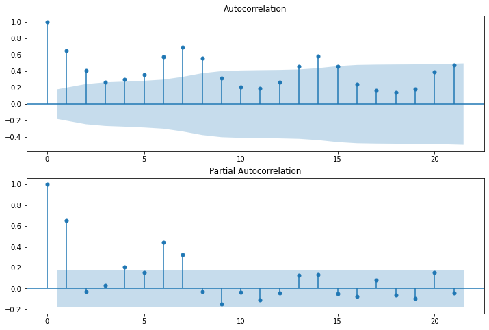

```python
import numpy as np
import pandas as pd
import matplotlib.pyplot as plt
import seaborn as sns

df = pd.read_csv("https://raw.githubusercontent.com/owid/covid-19-data/master/public/data/jhu/new_cases.csv")

india_df = pd.DataFrame(data = df["India"])
india_df.index = pd.to_datetime(df["date"])
india_df.columns=['Cases'] 

brazil_df = pd.DataFrame(df["Brazil"])
brazil_df.index = pd.to_datetime(df["date"])
brazil_df.columns=['Cases'] 

france_df = pd.DataFrame(df["France"])
france_df.index = pd.to_datetime(df["date"])
france_df.columns=['Cases'] 

uk_df = pd.DataFrame(df["United Kingdom"])
uk_df.index = pd.to_datetime(df["date"])
uk_df.columns=['Cases'] 

us_df = pd.DataFrame(df["United States"])
us_df.index = pd.to_datetime(df["date"])
us_df.columns=['Cases'] 

t1 = india_df[-102:-70]
t2 = brazil_df[-102:-70]
t3 = france_df[-102:-70]
t4 = uk_df[-102:-70]
t5 = us_df[-102:-70]

t1
```


<div>
<style scoped>
    .dataframe tbody tr th:only-of-type {
        vertical-align: middle;
    }

    .dataframe tbody tr th {
        vertical-align: top;
    }

    .dataframe thead th {
        text-align: right;
    }
</style>
<table border="1" class="dataframe">
  <thead>
    <tr style="text-align: right;">
      <th></th>
      <th>Cases</th>
    </tr>
    <tr>
      <th>date</th>
      <th></th>
    </tr>
  </thead>
  <tbody>
    <tr>
      <th>2021-10-25</th>
      <td>12428.0</td>
    </tr>
    <tr>
      <th>2021-10-26</th>
      <td>13451.0</td>
    </tr>
    <tr>
      <th>2021-10-27</th>
      <td>16156.0</td>
    </tr>
    <tr>
      <th>2021-10-28</th>
      <td>14348.0</td>
    </tr>
    <tr>
      <th>2021-10-29</th>
      <td>14313.0</td>
    </tr>
    <tr>
      <th>2021-10-30</th>
      <td>12830.0</td>
    </tr>
    <tr>
      <th>2021-10-31</th>
      <td>12514.0</td>
    </tr>
    <tr>
      <th>2021-11-01</th>
      <td>10423.0</td>
    </tr>
    <tr>
      <th>2021-11-02</th>
      <td>11903.0</td>
    </tr>
    <tr>
      <th>2021-11-03</th>
      <td>12885.0</td>
    </tr>
    <tr>
      <th>2021-11-04</th>
      <td>12729.0</td>
    </tr>
    <tr>
      <th>2021-11-05</th>
      <td>10929.0</td>
    </tr>
    <tr>
      <th>2021-11-06</th>
      <td>10826.0</td>
    </tr>
    <tr>
      <th>2021-11-07</th>
      <td>11478.0</td>
    </tr>
    <tr>
      <th>2021-11-08</th>
      <td>10126.0</td>
    </tr>
    <tr>
      <th>2021-11-09</th>
      <td>11466.0</td>
    </tr>
    <tr>
      <th>2021-11-10</th>
      <td>13091.0</td>
    </tr>
    <tr>
      <th>2021-11-11</th>
      <td>12516.0</td>
    </tr>
    <tr>
      <th>2021-11-12</th>
      <td>11850.0</td>
    </tr>
    <tr>
      <th>2021-11-13</th>
      <td>11271.0</td>
    </tr>
    <tr>
      <th>2021-11-14</th>
      <td>10229.0</td>
    </tr>
    <tr>
      <th>2021-11-15</th>
      <td>8865.0</td>
    </tr>
    <tr>
      <th>2021-11-16</th>
      <td>10197.0</td>
    </tr>
    <tr>
      <th>2021-11-17</th>
      <td>11919.0</td>
    </tr>
    <tr>
      <th>2021-11-18</th>
      <td>11106.0</td>
    </tr>
    <tr>
      <th>2021-11-19</th>
      <td>10302.0</td>
    </tr>
    <tr>
      <th>2021-11-20</th>
      <td>10488.0</td>
    </tr>
    <tr>
      <th>2021-11-21</th>
      <td>8488.0</td>
    </tr>
    <tr>
      <th>2021-11-22</th>
      <td>7579.0</td>
    </tr>
    <tr>
      <th>2021-11-23</th>
      <td>9283.0</td>
    </tr>
    <tr>
      <th>2021-11-24</th>
      <td>9119.0</td>
    </tr>
    <tr>
      <th>2021-11-25</th>
      <td>10549.0</td>
    </tr>
  </tbody>
</table>
</div>


```python
tr1 = india_df[-222:-102]
tr2 = brazil_df[-222:-102]
tr3 = france_df[-222:-102]
tr4 = uk_df[-222:-102]
tr5 = us_df[-222:-102]

tr1
```


<div>
<style scoped>
    .dataframe tbody tr th:only-of-type {
        vertical-align: middle;
    }

    .dataframe tbody tr th {
        vertical-align: top;
    }

    .dataframe thead th {
        text-align: right;
    }
</style>
<table border="1" class="dataframe">
  <thead>
    <tr style="text-align: right;">
      <th></th>
      <th>Cases</th>
    </tr>
    <tr>
      <th>date</th>
      <th></th>
    </tr>
  </thead>
  <tbody>
    <tr>
      <th>2021-06-27</th>
      <td>46148.0</td>
    </tr>
    <tr>
      <th>2021-06-28</th>
      <td>37566.0</td>
    </tr>
    <tr>
      <th>2021-06-29</th>
      <td>45951.0</td>
    </tr>
    <tr>
      <th>2021-06-30</th>
      <td>48786.0</td>
    </tr>
    <tr>
      <th>2021-07-01</th>
      <td>46617.0</td>
    </tr>
    <tr>
      <th>...</th>
      <td>...</td>
    </tr>
    <tr>
      <th>2021-10-20</th>
      <td>18454.0</td>
    </tr>
    <tr>
      <th>2021-10-21</th>
      <td>15786.0</td>
    </tr>
    <tr>
      <th>2021-10-22</th>
      <td>16326.0</td>
    </tr>
    <tr>
      <th>2021-10-23</th>
      <td>15906.0</td>
    </tr>
    <tr>
      <th>2021-10-24</th>
      <td>14306.0</td>
    </tr>
  </tbody>
</table>
<p>120 rows × 1 columns</p>
</div>


```python
tr1.drop(tr1.index[tr1["Cases"] == 0], axis = 0, inplace = True)
```

    C:\Users\troge\Anaconda3\lib\site-packages\pandas\core\frame.py:4906: SettingWithCopyWarning: 
    A value is trying to be set on a copy of a slice from a DataFrame
    
    See the caveats in the documentation: https://pandas.pydata.org/pandas-docs/stable/user_guide/indexing.html#returning-a-view-versus-a-copy
      return super().drop(
    


```python
tr2.drop(tr2.index[tr2["Cases"] == 0], axis = 0, inplace = True)
```

    C:\Users\troge\Anaconda3\lib\site-packages\pandas\core\frame.py:4906: SettingWithCopyWarning: 
    A value is trying to be set on a copy of a slice from a DataFrame
    
    See the caveats in the documentation: https://pandas.pydata.org/pandas-docs/stable/user_guide/indexing.html#returning-a-view-versus-a-copy
      return super().drop(
    


```python
tr3.drop(tr3.index[tr3["Cases"] == 0], axis = 0, inplace = True)
```

    C:\Users\troge\Anaconda3\lib\site-packages\pandas\core\frame.py:4906: SettingWithCopyWarning: 
    A value is trying to be set on a copy of a slice from a DataFrame
    
    See the caveats in the documentation: https://pandas.pydata.org/pandas-docs/stable/user_guide/indexing.html#returning-a-view-versus-a-copy
      return super().drop(
    


```python
tr4.drop(tr4.index[tr4["Cases"] == 0], axis = 0, inplace = True)
```

    C:\Users\troge\Anaconda3\lib\site-packages\pandas\core\frame.py:4906: SettingWithCopyWarning: 
    A value is trying to be set on a copy of a slice from a DataFrame
    
    See the caveats in the documentation: https://pandas.pydata.org/pandas-docs/stable/user_guide/indexing.html#returning-a-view-versus-a-copy
      return super().drop(
    


```python
tr5.drop(tr5.index[tr5["Cases"] == 0], axis = 0, inplace = True)
```

    C:\Users\troge\Anaconda3\lib\site-packages\pandas\core\frame.py:4906: SettingWithCopyWarning: 
    A value is trying to be set on a copy of a slice from a DataFrame
    
    See the caveats in the documentation: https://pandas.pydata.org/pandas-docs/stable/user_guide/indexing.html#returning-a-view-versus-a-copy
      return super().drop(
    


```python
t2.dropna(inplace = True)
```

    C:\Users\troge\Anaconda3\lib\site-packages\pandas\util\_decorators.py:311: SettingWithCopyWarning: 
    A value is trying to be set on a copy of a slice from a DataFrame
    
    See the caveats in the documentation: https://pandas.pydata.org/pandas-docs/stable/user_guide/indexing.html#returning-a-view-versus-a-copy
      return func(*args, **kwargs)
    


```python
### Testing For Stationarity

from statsmodels.tsa.stattools import adfuller
#test_result=adfuller(total_death_plot.iloc[-100:]['new_cases'])


#Ho: It is non stationary
#H1: It is stationary

def adfuller_test(data):
    result=adfuller(data)
    labels = ['ADF Test Statistic','p-value','#Lags Used','Number of Observations Used']
    for value,label in zip(result,labels):
        print(label+' : '+str(value) )
    if result[1] <= 0.05:
        print("strong evidence against the null hypothesis(Ho), reject the null hypothesis. Data has no unit root and is stationary")
    else:
        print("weak evidence against null hypothesis, time series has a unit root, indicating it is non-stationary ")
```


```python
adfuller_test(tr1)
```

    ADF Test Statistic : -0.023305894127867936
    p-value : 0.9565617402760928
    #Lags Used : 11
    Number of Observations Used : 108
    weak evidence against null hypothesis, time series has a unit root, indicating it is non-stationary 
    


```python
adfuller_test(tr2)
```

    ADF Test Statistic : -1.550695550597327
    p-value : 0.5083007410291838
    #Lags Used : 13
    Number of Observations Used : 105
    weak evidence against null hypothesis, time series has a unit root, indicating it is non-stationary 
    


```python
adfuller_test(tr3)
```

    ADF Test Statistic : -2.2760024665415663
    p-value : 0.17982448665803458
    #Lags Used : 11
    Number of Observations Used : 108
    weak evidence against null hypothesis, time series has a unit root, indicating it is non-stationary 
    


```python
adfuller_test(tr4)
```

    ADF Test Statistic : -2.727665862036383
    p-value : 0.06937199484338011
    #Lags Used : 10
    Number of Observations Used : 109
    weak evidence against null hypothesis, time series has a unit root, indicating it is non-stationary 
    


```python
adfuller_test(tr5)
```

    ADF Test Statistic : -1.7844886460732234
    p-value : 0.3881893869721253
    #Lags Used : 13
    Number of Observations Used : 106
    weak evidence against null hypothesis, time series has a unit root, indicating it is non-stationary 
    

# PACF and ACF Plots


```python
from statsmodels.graphics.tsaplots import plot_acf,plot_pacf
import statsmodels.api as sm
def ap(current_death_plot):
    fig = plt.figure(figsize=(12,8))
    ax1 = fig.add_subplot(211)
    fig = sm.graphics.tsa.plot_acf(current_death_plot['Cases'], ax=ax1)
    ax2 = fig.add_subplot(212)
    fig = sm.graphics.tsa.plot_pacf(current_death_plot['Cases'], method='ywm', ax=ax2)
```


```python
ap(tr1)
```


    

    


#### Indicating 2, 1, 2


```python
ap(tr2)
```


    

    


#### Indicates 1, 1, 2


```python
ap(tr3)
```


    

    


#### Indicates 3, 1, 4


```python
ap(tr4)
```


    

    


#### Indicates 1, 1, 3


```python
ap(tr5)
```


    

    


#### Indicates 2, 1, 3


```python
from statsmodels.tsa.arima.model import ARIMA
from statsmodels.tools.eval_measures import rmse
from math import sqrt

def calc_arima(train, test, order):

    model=ARIMA(train['Cases'],order=order)
    model_fit=model.fit()

    model_fit.summary()
    
    start = len(train)
    end = len(train) + len(test) -1
    pred = model_fit.predict(start = start, end = end, typ = 'levels')
    pred.index = test.index
    
    test['Arimaforecast'] = pred
    test[['Cases','Arimaforecast']].plot(figsize=(12,8))
    
    print("ARIMA 1 day ahead -", sqrt((pred[0] - test.iloc[0]["Cases"])**2))
    print("ARIMA 7 day ahead- ", rmse(pred[:8], test.iloc[:8]["Cases"]))
    print("ARIMA 30 day ahead- ", rmse(pred, test["Cases"]))
```


```python
calc_arima(tr1[-90:], t1, (2,1,2))
```

    C:\Users\troge\Anaconda3\lib\site-packages\statsmodels\tsa\base\tsa_model.py:524: ValueWarning: No frequency information was provided, so inferred frequency D will be used.
      warnings.warn('No frequency information was'
    C:\Users\troge\Anaconda3\lib\site-packages\statsmodels\tsa\base\tsa_model.py:524: ValueWarning: No frequency information was provided, so inferred frequency D will be used.
      warnings.warn('No frequency information was'
    C:\Users\troge\Anaconda3\lib\site-packages\statsmodels\tsa\base\tsa_model.py:524: ValueWarning: No frequency information was provided, so inferred frequency D will be used.
      warnings.warn('No frequency information was'
    C:\Users\troge\Anaconda3\lib\site-packages\statsmodels\tsa\statespace\sarimax.py:966: UserWarning: Non-stationary starting autoregressive parameters found. Using zeros as starting parameters.
      warn('Non-stationary starting autoregressive parameters'
    C:\Users\troge\Anaconda3\lib\site-packages\statsmodels\tsa\statespace\sarimax.py:978: UserWarning: Non-invertible starting MA parameters found. Using zeros as starting parameters.
      warn('Non-invertible starting MA parameters found.'
    C:\Users\troge\Anaconda3\lib\site-packages\statsmodels\base\model.py:566: ConvergenceWarning: Maximum Likelihood optimization failed to converge. Check mle_retvals
      warnings.warn("Maximum Likelihood optimization failed to "
    C:\Users\troge\AppData\Local\Temp/ipykernel_3384/2150701115.py:17: SettingWithCopyWarning: 
    A value is trying to be set on a copy of a slice from a DataFrame.
    Try using .loc[row_indexer,col_indexer] = value instead
    
    See the caveats in the documentation: https://pandas.pydata.org/pandas-docs/stable/user_guide/indexing.html#returning-a-view-versus-a-copy
      test['Arimaforecast'] = pred
    

    ARIMA 1 day ahead - 1468.9071766404613
    ARIMA 7 day ahead-  1863.7748675357793
    ARIMA 30 day ahead-  3190.9536828438486
    


    

    


```python
calc_arima(tr2, t2, (1,1,2))
```

    C:\Users\troge\Anaconda3\lib\site-packages\statsmodels\tsa\base\tsa_model.py:581: ValueWarning: A date index has been provided, but it has no associated frequency information and so will be ignored when e.g. forecasting.
      warnings.warn('A date index has been provided, but it has no'
    C:\Users\troge\Anaconda3\lib\site-packages\statsmodels\tsa\base\tsa_model.py:581: ValueWarning: A date index has been provided, but it has no associated frequency information and so will be ignored when e.g. forecasting.
      warnings.warn('A date index has been provided, but it has no'
    C:\Users\troge\Anaconda3\lib\site-packages\statsmodels\tsa\base\tsa_model.py:581: ValueWarning: A date index has been provided, but it has no associated frequency information and so will be ignored when e.g. forecasting.
      warnings.warn('A date index has been provided, but it has no'
    C:\Users\troge\Anaconda3\lib\site-packages\statsmodels\tsa\statespace\sarimax.py:978: UserWarning: Non-invertible starting MA parameters found. Using zeros as starting parameters.
      warn('Non-invertible starting MA parameters found.'
    C:\Users\troge\Anaconda3\lib\site-packages\statsmodels\tsa\base\tsa_model.py:376: ValueWarning: No supported index is available. Prediction results will be given with an integer index beginning at `start`.
      warnings.warn('No supported index is available.'
    C:\Users\troge\AppData\Local\Temp/ipykernel_3384/2150701115.py:17: SettingWithCopyWarning: 
    A value is trying to be set on a copy of a slice from a DataFrame.
    Try using .loc[row_indexer,col_indexer] = value instead
    
    See the caveats in the documentation: https://pandas.pydata.org/pandas-docs/stable/user_guide/indexing.html#returning-a-view-versus-a-copy
      test['Arimaforecast'] = pred
    

    ARIMA 1 day ahead - 976.5973952753302
    ARIMA 7 day ahead-  4065.2622047337154
    ARIMA 30 day ahead-  4376.524713642672
    


    

    


```python
calc_arima(tr3[-90:], t3, (3,1,4))
```

    C:\Users\troge\Anaconda3\lib\site-packages\statsmodels\tsa\base\tsa_model.py:524: ValueWarning: No frequency information was provided, so inferred frequency D will be used.
      warnings.warn('No frequency information was'
    C:\Users\troge\Anaconda3\lib\site-packages\statsmodels\tsa\base\tsa_model.py:524: ValueWarning: No frequency information was provided, so inferred frequency D will be used.
      warnings.warn('No frequency information was'
    C:\Users\troge\Anaconda3\lib\site-packages\statsmodels\tsa\base\tsa_model.py:524: ValueWarning: No frequency information was provided, so inferred frequency D will be used.
      warnings.warn('No frequency information was'
    C:\Users\troge\AppData\Local\Temp/ipykernel_3384/2150701115.py:17: SettingWithCopyWarning: 
    A value is trying to be set on a copy of a slice from a DataFrame.
    Try using .loc[row_indexer,col_indexer] = value instead
    
    See the caveats in the documentation: https://pandas.pydata.org/pandas-docs/stable/user_guide/indexing.html#returning-a-view-versus-a-copy
      test['Arimaforecast'] = pred
    

    ARIMA 1 day ahead - 1793.5138704028718
    ARIMA 7 day ahead-  1814.6170440440683
    ARIMA 30 day ahead-  11278.97298918396
    


    

    


```python
calc_arima(tr4, t4, (1,1,3))
```

    C:\Users\troge\Anaconda3\lib\site-packages\statsmodels\tsa\base\tsa_model.py:524: ValueWarning: No frequency information was provided, so inferred frequency D will be used.
      warnings.warn('No frequency information was'
    C:\Users\troge\Anaconda3\lib\site-packages\statsmodels\tsa\base\tsa_model.py:524: ValueWarning: No frequency information was provided, so inferred frequency D will be used.
      warnings.warn('No frequency information was'
    C:\Users\troge\Anaconda3\lib\site-packages\statsmodels\tsa\base\tsa_model.py:524: ValueWarning: No frequency information was provided, so inferred frequency D will be used.
      warnings.warn('No frequency information was'
    C:\Users\troge\AppData\Local\Temp/ipykernel_3384/2150701115.py:17: SettingWithCopyWarning: 
    A value is trying to be set on a copy of a slice from a DataFrame.
    Try using .loc[row_indexer,col_indexer] = value instead
    
    See the caveats in the documentation: https://pandas.pydata.org/pandas-docs/stable/user_guide/indexing.html#returning-a-view-versus-a-copy
      test['Arimaforecast'] = pred
    

    ARIMA 1 day ahead - 2605.082304959862
    ARIMA 7 day ahead-  2824.847555908575
    ARIMA 30 day ahead-  4556.650824400998
    


    

    


```python
calc_arima(tr5, t5, (2,1,3))
```

    C:\Users\troge\Anaconda3\lib\site-packages\statsmodels\tsa\base\tsa_model.py:524: ValueWarning: No frequency information was provided, so inferred frequency D will be used.
      warnings.warn('No frequency information was'
    C:\Users\troge\Anaconda3\lib\site-packages\statsmodels\tsa\base\tsa_model.py:524: ValueWarning: No frequency information was provided, so inferred frequency D will be used.
      warnings.warn('No frequency information was'
    C:\Users\troge\Anaconda3\lib\site-packages\statsmodels\tsa\base\tsa_model.py:524: ValueWarning: No frequency information was provided, so inferred frequency D will be used.
      warnings.warn('No frequency information was'
    C:\Users\troge\AppData\Local\Temp/ipykernel_3384/2150701115.py:17: SettingWithCopyWarning: 
    A value is trying to be set on a copy of a slice from a DataFrame.
    Try using .loc[row_indexer,col_indexer] = value instead
    
    See the caveats in the documentation: https://pandas.pydata.org/pandas-docs/stable/user_guide/indexing.html#returning-a-view-versus-a-copy
      test['Arimaforecast'] = pred
    

    ARIMA 1 day ahead - 23046.65968735583
    ARIMA 7 day ahead-  26139.88211925675
    ARIMA 30 day ahead-  34367.18403536885
    


    

    


```python
from pmdarima import auto_arima
from statsmodels.tsa.statespace.sarimax import SARIMAX


import warnings

warnings.filterwarnings("ignore")

def calc_sarima(train, test):
    stepwise_fit = auto_arima(train["Cases"], seasonal=True, m = 3, stepwise=True, trace = True, suppress_warnings = True)


    model=SARIMAX(train, order=stepwise_fit.get_params()["order"], seasonal_order = stepwise_fit.get_params()["seasonal_order"])
    model_fit1=model.fit(disp=0)
    model_fit1.summary()
    
    start = len(train)
    end = len(train) + len(test) -1
    
    pred = model_fit1.predict(start = start, end = end, typ = 'levels')
    pred.index = test.index
    
    test['Sarimaforecast'] = pred
    test[['Cases','Sarimaforecast']].plot(figsize=(12,8))
    
    print("SARIMA 1 day ahead -", sqrt((pred[0] - test.iloc[0]["Cases"])**2))
    print("SARIMA 7 day ahead- ", rmse(pred[:8], test.iloc[:8]["Cases"]))
    print("SARIMA 30 day ahead- ", rmse(pred, test["Cases"]))
```


```python
calc_sarima(tr1[-115:], t1)
```

    Performing stepwise search to minimize aic
     ARIMA(2,1,2)(1,0,1)[3] intercept   : AIC=2222.020, Time=0.54 sec
     ARIMA(0,1,0)(0,0,0)[3] intercept   : AIC=2256.911, Time=0.01 sec
     ARIMA(1,1,0)(1,0,0)[3] intercept   : AIC=2257.881, Time=0.04 sec
     ARIMA(0,1,1)(0,0,1)[3] intercept   : AIC=2256.339, Time=0.06 sec
     ARIMA(0,1,0)(0,0,0)[3]             : AIC=2255.263, Time=0.01 sec
     ARIMA(2,1,2)(0,0,1)[3] intercept   : AIC=2220.309, Time=0.40 sec
     ARIMA(2,1,2)(0,0,0)[3] intercept   : AIC=2263.011, Time=0.13 sec
     ARIMA(2,1,2)(0,0,2)[3] intercept   : AIC=2222.061, Time=0.51 sec
     ARIMA(2,1,2)(1,0,0)[3] intercept   : AIC=2221.245, Time=0.46 sec
     ARIMA(2,1,2)(1,0,2)[3] intercept   : AIC=2223.351, Time=0.64 sec
     ARIMA(1,1,2)(0,0,1)[3] intercept   : AIC=2252.648, Time=0.17 sec
     ARIMA(2,1,1)(0,0,1)[3] intercept   : AIC=2245.096, Time=0.17 sec
     ARIMA(1,1,1)(0,0,1)[3] intercept   : AIC=2254.715, Time=0.11 sec
     ARIMA(2,1,2)(0,0,1)[3]             : AIC=2218.731, Time=0.38 sec
     ARIMA(2,1,2)(0,0,0)[3]             : AIC=inf, Time=0.37 sec
     ARIMA(2,1,2)(1,0,1)[3]             : AIC=2220.576, Time=0.47 sec
     ARIMA(2,1,2)(0,0,2)[3]             : AIC=2220.492, Time=0.48 sec
     ARIMA(2,1,2)(1,0,0)[3]             : AIC=2219.946, Time=0.40 sec
     ARIMA(2,1,2)(1,0,2)[3]             : AIC=2218.545, Time=0.67 sec
     ARIMA(2,1,2)(2,0,2)[3]             : AIC=2222.200, Time=0.81 sec
     ARIMA(2,1,2)(2,0,1)[3]             : AIC=inf, Time=0.55 sec
     ARIMA(1,1,2)(1,0,2)[3]             : AIC=2248.257, Time=0.26 sec
     ARIMA(2,1,1)(1,0,2)[3]             : AIC=2248.372, Time=0.26 sec
     ARIMA(1,1,1)(1,0,2)[3]             : AIC=2250.187, Time=0.24 sec
    
    Best model:  ARIMA(2,1,2)(1,0,2)[3]          
    Total fit time: 8.183 seconds
    SARIMA 1 day ahead - 108.12844063152443
    SARIMA 7 day ahead-  1357.9976996571297
    SARIMA 30 day ahead-  1432.1670101378907
    


    

    


```python
tr2.dropna(inplace = True)
calc_sarima(tr2, t2)
```

    Performing stepwise search to minimize aic
     ARIMA(2,1,2)(1,0,1)[3] intercept   : AIC=2554.578, Time=0.34 sec
     ARIMA(0,1,0)(0,0,0)[3] intercept   : AIC=2592.633, Time=0.01 sec
     ARIMA(1,1,0)(1,0,0)[3] intercept   : AIC=2583.236, Time=0.05 sec
     ARIMA(0,1,1)(0,0,1)[3] intercept   : AIC=2559.386, Time=0.24 sec
     ARIMA(0,1,0)(0,0,0)[3]             : AIC=2590.670, Time=0.01 sec
     ARIMA(2,1,2)(0,0,1)[3] intercept   : AIC=2584.778, Time=0.26 sec
     ARIMA(2,1,2)(1,0,0)[3] intercept   : AIC=2544.946, Time=0.49 sec
     ARIMA(2,1,2)(0,0,0)[3] intercept   : AIC=inf, Time=0.49 sec
     ARIMA(2,1,2)(2,0,0)[3] intercept   : AIC=2557.888, Time=0.25 sec
     ARIMA(2,1,2)(2,0,1)[3] intercept   : AIC=2545.148, Time=0.49 sec
     ARIMA(1,1,2)(1,0,0)[3] intercept   : AIC=2554.541, Time=0.15 sec
     ARIMA(2,1,1)(1,0,0)[3] intercept   : AIC=2548.120, Time=0.45 sec
     ARIMA(1,1,1)(1,0,0)[3] intercept   : AIC=2549.785, Time=0.32 sec
     ARIMA(2,1,2)(1,0,0)[3]             : AIC=2557.900, Time=0.14 sec
    
    Best model:  ARIMA(2,1,2)(1,0,0)[3] intercept
    Total fit time: 3.713 seconds
    SARIMA 1 day ahead - 1639.8314584852633
    SARIMA 7 day ahead-  3348.919171049615
    SARIMA 30 day ahead-  4151.334597243365
    


    

    


```python
calc_sarima(tr3, t3)
```

    Performing stepwise search to minimize aic
     ARIMA(2,1,2)(1,0,1)[3] intercept   : AIC=2412.609, Time=0.36 sec
     ARIMA(0,1,0)(0,0,0)[3] intercept   : AIC=2490.696, Time=0.01 sec
     ARIMA(1,1,0)(1,0,0)[3] intercept   : AIC=2464.273, Time=0.05 sec
     ARIMA(0,1,1)(0,0,1)[3] intercept   : AIC=2432.819, Time=0.05 sec
     ARIMA(0,1,0)(0,0,0)[3]             : AIC=2488.702, Time=0.01 sec
     ARIMA(2,1,2)(0,0,1)[3] intercept   : AIC=2422.953, Time=0.28 sec
     ARIMA(2,1,2)(1,0,0)[3] intercept   : AIC=2414.744, Time=0.29 sec
     ARIMA(2,1,2)(2,0,1)[3] intercept   : AIC=2405.891, Time=0.60 sec
     ARIMA(2,1,2)(2,0,0)[3] intercept   : AIC=2410.087, Time=0.40 sec
     ARIMA(2,1,2)(2,0,2)[3] intercept   : AIC=2407.889, Time=0.83 sec
     ARIMA(2,1,2)(1,0,2)[3] intercept   : AIC=2410.658, Time=0.56 sec
     ARIMA(1,1,2)(2,0,1)[3] intercept   : AIC=2418.369, Time=0.51 sec
     ARIMA(2,1,1)(2,0,1)[3] intercept   : AIC=2424.559, Time=0.57 sec
     ARIMA(1,1,1)(2,0,1)[3] intercept   : AIC=2435.262, Time=0.21 sec
     ARIMA(2,1,2)(2,0,1)[3]             : AIC=2403.941, Time=0.56 sec
     ARIMA(2,1,2)(1,0,1)[3]             : AIC=2410.673, Time=0.34 sec
     ARIMA(2,1,2)(2,0,0)[3]             : AIC=2408.148, Time=0.31 sec
     ARIMA(2,1,2)(2,0,2)[3]             : AIC=2405.939, Time=0.76 sec
     ARIMA(2,1,2)(1,0,0)[3]             : AIC=2412.796, Time=0.26 sec
     ARIMA(2,1,2)(1,0,2)[3]             : AIC=2408.707, Time=0.52 sec
     ARIMA(1,1,2)(2,0,1)[3]             : AIC=2415.588, Time=0.64 sec
     ARIMA(2,1,1)(2,0,1)[3]             : AIC=2422.313, Time=0.49 sec
     ARIMA(1,1,1)(2,0,1)[3]             : AIC=2433.284, Time=0.17 sec
    
    Best model:  ARIMA(2,1,2)(2,0,1)[3]          
    Total fit time: 8.792 seconds
    SARIMA 1 day ahead - 2588.6049393290214
    SARIMA 7 day ahead-  1518.8787846453065
    SARIMA 30 day ahead-  10933.73503574672
    


    

    


```python
calc_sarima(tr4[-99:], t4)
```

    Performing stepwise search to minimize aic
     ARIMA(2,1,2)(1,0,1)[3] intercept   : AIC=inf, Time=0.62 sec
     ARIMA(0,1,0)(0,0,0)[3] intercept   : AIC=1895.462, Time=0.01 sec
     ARIMA(1,1,0)(1,0,0)[3] intercept   : AIC=1891.543, Time=0.04 sec
     ARIMA(0,1,1)(0,0,1)[3] intercept   : AIC=1891.808, Time=0.06 sec
     ARIMA(0,1,0)(0,0,0)[3]             : AIC=1893.524, Time=0.01 sec
     ARIMA(1,1,0)(0,0,0)[3] intercept   : AIC=1891.180, Time=0.04 sec
     ARIMA(1,1,0)(0,0,1)[3] intercept   : AIC=1891.263, Time=0.07 sec
     ARIMA(1,1,0)(1,0,1)[3] intercept   : AIC=1890.524, Time=0.52 sec
     ARIMA(1,1,0)(2,0,1)[3] intercept   : AIC=1892.698, Time=0.24 sec
     ARIMA(1,1,0)(1,0,2)[3] intercept   : AIC=1893.827, Time=0.25 sec
     ARIMA(1,1,0)(0,0,2)[3] intercept   : AIC=1891.701, Time=0.07 sec
     ARIMA(1,1,0)(2,0,0)[3] intercept   : AIC=1892.338, Time=0.06 sec
     ARIMA(1,1,0)(2,0,2)[3] intercept   : AIC=1893.842, Time=0.31 sec
     ARIMA(0,1,0)(1,0,1)[3] intercept   : AIC=1896.327, Time=0.20 sec
     ARIMA(2,1,0)(1,0,1)[3] intercept   : AIC=1893.373, Time=0.17 sec
     ARIMA(1,1,1)(1,0,1)[3] intercept   : AIC=1893.115, Time=0.25 sec
     ARIMA(0,1,1)(1,0,1)[3] intercept   : AIC=1891.845, Time=0.11 sec
     ARIMA(2,1,1)(1,0,1)[3] intercept   : AIC=1892.957, Time=0.44 sec
     ARIMA(1,1,0)(1,0,1)[3]             : AIC=1888.769, Time=0.17 sec
     ARIMA(1,1,0)(0,0,1)[3]             : AIC=1889.248, Time=0.04 sec
     ARIMA(1,1,0)(1,0,0)[3]             : AIC=1889.534, Time=0.03 sec
     ARIMA(1,1,0)(2,0,1)[3]             : AIC=1890.546, Time=0.22 sec
     ARIMA(1,1,0)(1,0,2)[3]             : AIC=1891.819, Time=0.22 sec
     ARIMA(1,1,0)(0,0,0)[3]             : AIC=1889.184, Time=0.02 sec
     ARIMA(1,1,0)(0,0,2)[3]             : AIC=1889.660, Time=0.05 sec
     ARIMA(1,1,0)(2,0,0)[3]             : AIC=1890.317, Time=0.06 sec
     ARIMA(1,1,0)(2,0,2)[3]             : AIC=1891.761, Time=0.27 sec
     ARIMA(0,1,0)(1,0,1)[3]             : AIC=1894.351, Time=0.11 sec
     ARIMA(2,1,0)(1,0,1)[3]             : AIC=1890.643, Time=0.26 sec
     ARIMA(1,1,1)(1,0,1)[3]             : AIC=1890.689, Time=0.28 sec
     ARIMA(0,1,1)(1,0,1)[3]             : AIC=1889.201, Time=0.16 sec
     ARIMA(2,1,1)(1,0,1)[3]             : AIC=1890.749, Time=0.35 sec
    
    Best model:  ARIMA(1,1,0)(1,0,1)[3]          
    Total fit time: 5.766 seconds
    SARIMA 1 day ahead - 4264.095982742911
    SARIMA 7 day ahead-  2820.00801968239
    SARIMA 30 day ahead-  4827.3580799550955
    


    

    


```python
calc_sarima(tr5, t5)
```

    Performing stepwise search to minimize aic
     ARIMA(2,1,2)(1,0,1)[3] intercept   : AIC=2906.720, Time=0.43 sec
     ARIMA(0,1,0)(0,0,0)[3] intercept   : AIC=3004.680, Time=0.01 sec
     ARIMA(1,1,0)(1,0,0)[3] intercept   : AIC=2988.035, Time=0.05 sec
     ARIMA(0,1,1)(0,0,1)[3] intercept   : AIC=2945.203, Time=0.07 sec
     ARIMA(0,1,0)(0,0,0)[3]             : AIC=3002.685, Time=0.01 sec
     ARIMA(2,1,2)(0,0,1)[3] intercept   : AIC=2911.215, Time=0.37 sec
     ARIMA(2,1,2)(1,0,0)[3] intercept   : AIC=2915.682, Time=0.50 sec
     ARIMA(2,1,2)(2,0,1)[3] intercept   : AIC=2901.852, Time=0.99 sec
     ARIMA(2,1,2)(2,0,0)[3] intercept   : AIC=2901.969, Time=0.48 sec
     ARIMA(2,1,2)(2,0,2)[3] intercept   : AIC=inf, Time=0.92 sec
     ARIMA(2,1,2)(1,0,2)[3] intercept   : AIC=2903.722, Time=0.75 sec
     ARIMA(1,1,2)(2,0,1)[3] intercept   : AIC=2945.559, Time=0.29 sec
     ARIMA(2,1,1)(2,0,1)[3] intercept   : AIC=2925.987, Time=0.35 sec
     ARIMA(1,1,1)(2,0,1)[3] intercept   : AIC=2948.429, Time=0.27 sec
     ARIMA(2,1,2)(2,0,1)[3]             : AIC=2899.956, Time=0.75 sec
     ARIMA(2,1,2)(1,0,1)[3]             : AIC=2904.948, Time=0.32 sec
     ARIMA(2,1,2)(2,0,0)[3]             : AIC=2900.161, Time=0.51 sec
     ARIMA(2,1,2)(2,0,2)[3]             : AIC=inf, Time=0.74 sec
     ARIMA(2,1,2)(1,0,0)[3]             : AIC=2913.757, Time=0.33 sec
     ARIMA(2,1,2)(1,0,2)[3]             : AIC=2901.920, Time=0.68 sec
     ARIMA(1,1,2)(2,0,1)[3]             : AIC=2942.449, Time=0.24 sec
     ARIMA(2,1,1)(2,0,1)[3]             : AIC=2924.365, Time=0.28 sec
     ARIMA(1,1,1)(2,0,1)[3]             : AIC=2945.509, Time=0.20 sec
    
    Best model:  ARIMA(2,1,2)(2,0,1)[3]          
    Total fit time: 9.600 seconds
    SARIMA 1 day ahead - 32182.583873628464
    SARIMA 7 day ahead-  23498.101883848052
    SARIMA 30 day ahead-  32884.47052359947
    


    

    


```python
from math import sqrt
from decimal import Decimal

def format_e(n):
    a = '%E' % n
    return a.split('E')[0].rstrip('0').rstrip('.') + 'E' + a.split('E')[1]

am = 0
bm = 0
cm = 0
xm = 0
ym = 0
zm = 0

def add_to_main(country, t1):
    a = sqrt((t1.iloc[0]["Arimaforecast"] - t1.iloc[0]["Cases"])**2)
    b = rmse(t1.iloc[:8]["Arimaforecast"], t1.iloc[:8]["Cases"])
    c = rmse(t1["Arimaforecast"], t1["Cases"])
    global am, bm, cm, xm, ym, zm
    am += a
    bm += b
    cm += c
    
    
    x = sqrt((t1.iloc[0]["Sarimaforecast"] - t1.iloc[0]["Cases"])**2)
    y = rmse(t1.iloc[:8]["Sarimaforecast"], t1.iloc[:8]["Cases"])
    z = rmse(t1["Sarimaforecast"], t1["Cases"])
    
    xm += x
    ym += y
    zm += z
    
    print(country, "ARIMA 1, 7 & 30 days", format_e(Decimal(a)), format_e(Decimal(b)), format_e(Decimal(c)), sep="\t")
    print(country, "SARIMA 1, 7 & 30 days", format_e(Decimal(x)),format_e(Decimal(y)), format_e(Decimal(z)), sep="\t")
    print()
    
add_to_main("India", t1)
add_to_main("Brazil", t2)
add_to_main("France", t3)
add_to_main("United Kingdom", t4)
add_to_main("United States", t5)
```

    India	ARIMA 1, 7 & 30 days	1.468907E+03	1.863775E+03	3.190954E+03
    India	SARIMA 1, 7 & 30 days	1.081284E+02	1.357998E+03	1.432167E+03
    
    Brazil	ARIMA 1, 7 & 30 days	9.765974E+02	4.065262E+03	4.376525E+03
    Brazil	SARIMA 1, 7 & 30 days	1.639831E+03	3.348919E+03	4.151335E+03
    
    France	ARIMA 1, 7 & 30 days	1.793514E+03	1.814617E+03	1.127897E+04
    France	SARIMA 1, 7 & 30 days	2.588605E+03	1.518879E+03	1.093374E+04
    
    United Kingdom	ARIMA 1, 7 & 30 days	2.605082E+03	2.824848E+03	4.556651E+03
    United Kingdom	SARIMA 1, 7 & 30 days	4.264096E+03	2.820008E+03	4.827358E+03
    
    United States	ARIMA 1, 7 & 30 days	2.304666E+04	2.613988E+04	3.436718E+04
    United States	SARIMA 1, 7 & 30 days	3.218258E+04	2.34981E+04	3.288447E+04
    
    


```python
print(format_e(Decimal(am/5)), format_e(Decimal(bm/5)),format_e(Decimal(cm/5)))
```

    5.978152E+03 7.341677E+03 1.155406E+04
    


```python
print(format_e(Decimal(xm/5)), format_e(Decimal(ym/5)), format_e(Decimal(zm/5)))
```

    8.156649E+03 6.508781E+03 1.084581E+04
    


```python
# Brazil
lstm = [10127.216 , 11259.471 , 11982.813 , 12685.478 , 12198.287 ,
       11151.477 ,  9685.254 ,  8438.074 ,  9171.393 , 13328.209 ,
       13101.495 , 13294.281 , 12546.482 ,  9851.093 ,  9217.796 ,
       10002.8545, 11282.956 , 12571.117 , 11864.263 , 10196.381 ,
        8144.7607,  7322.724 ,  8100.5815, 11558.077 , 11367.433 ,
       11617.429 ,  9979.936 ,  8722.884 ,  7810.077 ,  9842.304 ,
       10658.876 , 11257.009 ]

t2["lstm"] = lstm

```


```python
# India
lstm = [14385.734 , 13227.582 , 13009.095 , 13324.954 , 13515.615 ,
       12987.39  , 12588.012 , 12578.196 , 12051.428 , 12218.358 ,
       12985.064 , 13302.065 , 13238.266 , 12950.536 , 12346.83  ,
       11411.994 , 11290.589 , 11919.214 , 12069.323 , 11870.315 ,
       11807.224 , 11006.287 , 10106.988 , 10141.106 , 10147.634 ,
       10729.8955, 10305.1875, 10193.467 ,  9935.54  ,  9257.092 ,
        9534.755 , 10048.459 ]

t1["lstm"] = lstm
```


```python
# UK
lstm = [39842.918, 39786.086, 37642.652, 38381.945, 37715.562, 36253.137,
       34163.348, 32665.672, 32224.457, 32326.658, 34278.258, 36746.613,
       37479.805, 37692.77 , 37348.613, 38006.07 , 37686.76 , 37627.73 ,
       40330.   , 41526.508, 41033.51 , 40573.215, 41711.656, 41968.805,
       42105.742, 43317.47 , 45075.934, 43368.168, 41197.38 , 41276.09 ,
       40627.133, 42533.715]
t4["lstm"] = lstm
```


```python
# US
lstm = [ 87410.67 ,  77423.92 ,  83320.81 ,  73765.305,  74120.17 ,
        62646.047,  69290.63 ,  86892.74 ,  75917.82 ,  79489.54 ,
        77932.836,  75116.96 ,  65576.63 ,  73662.65 ,  90616.44 ,
        84208.55 ,  86648.04 ,  82201.36 , 101674.4  ,  75157.055,
        82913.484, 108538.31 ,  95934.15 , 102175.99 , 100043.586,
        92938.25 ,  69594.78 ,  75555.125,  97702.86 ,  81841.766,
        81613.38 ,  65045.332]

t5["lstm"] = lstm
```


```python
# France
lstm = [ 4356.611 ,  4580.4307,  4182.542 ,  4525.3037,  4811.0503,
        5096.3027,  5261.782 ,  5412.655 ,  5587.6177,  7151.2886,
        7180.0654,  7596.679 ,  7031.287 ,  7526.9727,  7904.372 ,
        8578.975 ,  9406.542 , 10493.227 , 11126.202 , 13748.338 ,
       14681.912 , 15681.264 , 16927.814 , 18194.096 , 19422.604 ,
       21317.74  , 23000.377 , 24668.076 , 26377.564 , 28173.145 ,
       29699.24  , 31681.527 ]

t3["lstm"] = lstm
```


```python
# India
lr = [14840.49574002,
        14494.09566699,
        14147.69559396,
        13801.29552093,
        13454.89544791,
        13108.49537488,
        12762.09530185,
        12415.69522882,
        12069.29515579,
        11722.89508277,
        11376.49500974,
        11030.09493671,
        10683.69486368,
        10337.29479065,
         9990.89471762,
         9644.4946446 ,
         9298.09457157,
         8951.69449854,
         8605.29442551,
         8258.89435248,
         7912.49427945,
         7566.09420643,
         7219.6941334 ,
         6873.29406037,
         6526.89398734,
         6180.49391431,
         5834.09384129,
         5487.69376826,
         5141.29369523,
         4794.8936222 ,
         4448.49354917,
         4102.09347614] 
t1["lr"] = lr
```


```python
# Brazil 
lr = [ 8653.97604927,
         8395.23281782,
         8136.48958636,
         7877.74635491,
         7619.00312346,
         7360.25989201,
         7101.51666055,
         6842.7734291 ,
         6584.03019765,
         6325.2869662 ,
         6066.54373475,
         5807.80050329,
         5549.05727184,
         5290.31404039,
         5031.57080894,
         4772.82757749,
         4514.08434603,
         4255.34111458,
         3996.59788313,
         3737.85465168,
         3479.11142023,
         3220.36818877,
         2961.62495732,
         2702.88172587,
         2444.13849442,
         2185.39526296,
         1926.65203151,
         1667.90880006,
         1409.16556861,
         1150.42233716,
          891.6791057 ,
          632.93587425] 
t2["lr"] = lr
```


```python
# France
lr = [ 5384.26995074,
         5426.73940887,
         5469.208867  ,
         5511.67832512,
         5554.14778325,
         5596.61724138,
         5639.08669951,
         5681.55615764,
         5724.02561576,
         5766.49507389,
         5808.96453202,
         5851.43399015,
         5893.90344828,
         5936.3729064 ,
         5978.84236453,
         6021.31182266,
         6063.78128079,
         6106.25073892,
         6148.72019704,
         6191.18965517,
         6233.6591133 ,
         6276.12857143,
         6318.59802956,
         6361.06748768,
         6403.53694581,
         6446.00640394,
         6488.47586207,
         6530.9453202 ,
         6573.41477833,
         6615.88423645,
         6658.35369458,
         6700.82315271]

t3["lr"] = lr
```


```python
# UK
lr = [41992.95133885,
        42164.23666018,
        42335.5219815 ,
        42506.80730282,
        42678.09262415,
        42849.37794547,
        43020.6632668 ,
        43191.94858812,
        43363.23390944,
        43534.51923077,
        43705.80455209,
        43877.08987342,
        44048.37519474,
        44219.66051607,
        44390.94583739,
        44562.23115871,
        44733.51648004,
        44904.80180136,
        45076.08712269,
        45247.37244401,
        45418.65776534,
        45589.94308666,
        45761.22840798,
        45932.51372931,
        46103.79905063,
        46275.08437196,
        46446.36969328,
        46617.65501461,
        46788.94033593,
        46960.22565725,
        47131.51097858,
        47302.7962999 ] 
t4["lr"] = lr
```


```python
# US
lr = [80191.35167965,
        79150.84065239,
        78110.32962512,
        77069.81859786,
        76029.30757059,
        74988.79654333,
        73948.28551607,
        72907.7744888 ,
        71867.26346154,
        70826.75243427,
        69786.24140701,
        68745.73037975,
        67705.21935248,
        66664.70832522,
        65624.19729796,
        64583.68627069,
        63543.17524343,
        62502.66421616,
        61462.1531889 ,
        60421.64216164,
        59381.13113437,
        58340.62010711,
        57300.10907984,
        56259.59805258,
        55219.08702532,
        54178.57599805,
        53138.06497079,
        52097.55394352, 
        51057.04291626,
        50016.531889  ,
        48976.02086173,
        47935.50983447] 
t5["lr"] = lr
```


```python
def plot(country, test):
    sns.set(font_scale=0.8)

    plt.figure(figsize = (10, 4))
    
    plt.title(country)

    plt.plot(test["Arimaforecast"], label ='ARIMA')
    plt.plot(test["Sarimaforecast"], label ='SARIMA')
    plt.plot(test["lstm"], label ='LSTM')
    plt.plot(test["lr"], label = "LR")
    plt.plot(test["Cases"], label ='Actual')

    plt.legend(loc ="best")
```


```python
plot("India", t1)
```


    

    


```python
plot("Brazil", t2)
```


    

    


```python
plot("France", t3)
```


    

    


```python
plot("UK", t4)
```


    

    


```python
plot("USA", t5)
```


    

    


```python

```
